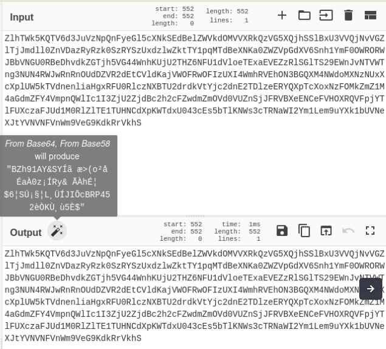
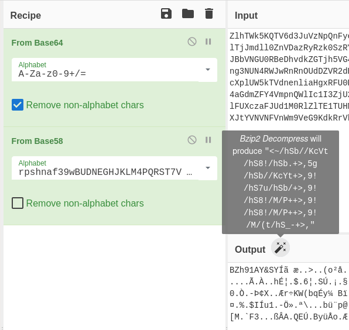
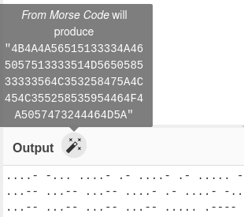
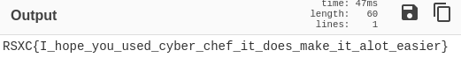

# Day 3 - What does this mean?

When looking for the prizes to this challenge we came across some text we can't understand, can you help us figure out what it means?


## Write-Up
We start by looking at the contents of the given link and find some kind of scrambled text.

```03-challenge.txt
ZlhTWk5KQTV6d3JuVzNpQnFyeGl5cXNkSEdBelZWVkdOMVVXRkQzVG5XQjhSSlBxU3VVQjNvVGZlTjJmdll0ZnVDazRyRzk0SzRYSzUxdz
lwZktTY1pqMTdBeXNKa0ZWZVpGdXV6Snh1YmF0OWRORWJBbVNGU0RBeDhvdkZGTjh5VG44WnhKUjU2THZ6NFU1dVloeTExaEVEZzRlSGlT
S29EWnJvNTVWTng3NUN4RWJwRnRnOUdDZVR2dEtCVldKajVWOFRwOFIzUXI4WmhRVEhON3BGQXM4NWdoMXNzNUxXcXplUW5kTVdnenliaH
gxRFU0RlczNXBTU2drdkVtYjc2dnE2TDlzeERYQXpTcXoxNzFOMkZmZ1M4aGdmZFY4VmpnQWlIc1I3ZjU2ZjdBc2h2cFZwdmZmOVd0VUZn
SjJFRVBXeENCeFVHOXRQVFpjYTlFUXczaFJUd1M0RlZlTE1TUHNCdXpKWTdxU043cEs5bTlKNWs3cTRNaWI2Ym1Lem9uYXk1bUVNeXJtYV
NVNFVnWm9VeG9KdkRrVkhS
```

This looks very much like `Base64` and we start with testing this from a shell...

```shell
$ echo -n 'ZlhT[...]I2Ym1Lem9uYXk1bUVNeXJtYVNVNFVnWm9VeG9KdkRrVkhS' | base64 -d
```
The output does not help us much, as this is also is scrambled.

``` 
fXSZNJA5zwrnW3iBqrxiyqsdHGAzVVVGN1UWFD3TnWB8RJPqSuUB3oTfeN2fvYtfuCk4rG94K4XK51w9pfKScZj17AysJkFVeZFuuzJxub
at9dNEbAmSFSDAx8ovFFN8yTn8ZxJR56Lvz4U5uYhy11hEDg4eHiSKoDZro55VNx75CxEbpFtg9GCeTvtKBVWJj5V8Tp8R3Qr8ZhQTHN7p
FAs85gh1ss5LWqzeQndMWgzybhx1DU4FW35pSSgkvEmb76vq6L9sxDXAzSqz171N2FfgS8hgfdV8VjgAiHsR7f56f7AshvpVpvff9WtUFg
J2EEPWxCBxUG9tPTZca9EQw3hRTwS4FVeLMSPsBuzJY7qSN7pK9m9J5k7q4Mib6bmKzonay5mEMyrmaSU4UgZoUxoJvDkVHR 
```

Thinking this challenge will include serveral stages of decoding, it's time to enter "River Security MasterChef" with [CyberChef](https://gchq.github.io/CyberChef/). If `CyberChef` is new territory, then you are in for a blast. One special element in the GUI is worth having an eye out for, the magic wand next to the output.


Right out of the gate "The Chef" looks to have som "magic" recipe for us.



`From Base64` was our first guess, so we agree with "The Chef" and also with his suggstion for `From Base58`. And again we are given a magic suggestion; `Bzip2 Decompress`.



Now we are left by ourself at the "pots"... Trying several ingredients in our recipe, we should find that `from base85` gives us something that doesn't look like gibberish. "The Chef" is also back at our side and has a new magic ingredient for us to try..



Now "The Chef" helps us all the way to the finish. Using the magic suggesions should give us the following recipe:
- From Base64
- Brom Base58
- Bzip2 Decompress
- From Base85
- From Morse Code
- From Hex
- From Base32

And we are given the flag as output



## The Flag
RSXC{I_hope_you_used_cyber_chef_it_does_make_it_alot_easier}