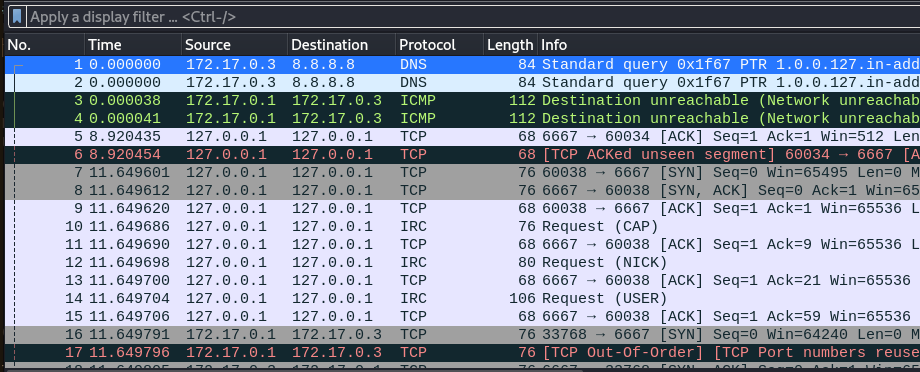
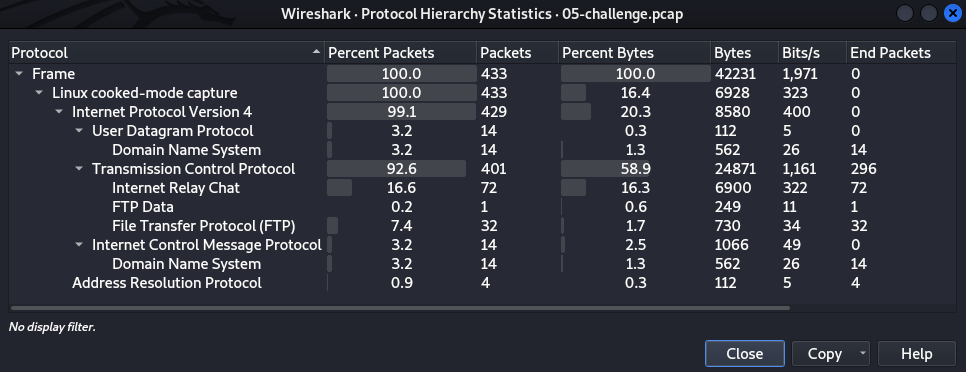
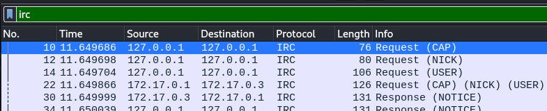
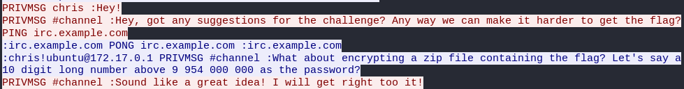
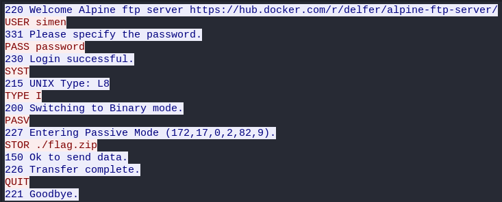
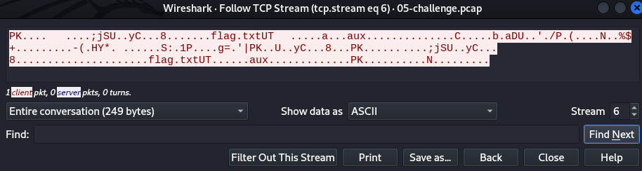

# Day 5 - Plain discussion
A spy was listening in on some of our discussion about todays challenge. Can you figure out what he found? 


## Write-Up
For this challenge we are given a pcap file to download. PCAP files contains captured network traffic and my tool of choice to view these are `Wireshark`. Opening the pcap file we stare at the following



There are many interesting things to notice here. We see connections to port 6667, which is a known port used by IRC. We also see Wireshark has recognized IRC as protocl and see known IRC commands; NICK. Before we look further, let us look at some statistics of the caputred data. `Statistics -> Protocol Hierarchy`



The key takeaway from this and that we should investigate further should be the IRC and FTP traffic. If this does not give us hints, we could also look at DNS or ICMP traffic.

Focusing on the IRC traffic first, we filter out this traffic with a simple filter of just `irc`.



IRC communications should be interesting, so let us take a look; Right-Click on packet packet 10 and select `Follow -> TCP Stream". Keyboard Shortcut: `Ctrl + Shift + Alt + T`

We now get a new window where we see the communication. There is a lot of server messages, but we also get our first hint!



We should be looking for a zip file. And we now know that the password for decrypting this zip file is a 10 digit number: 9 954 000 000 < x < 10 000 000 000.

Looking through the TCP streams we should come across some FTP traffic telling us what Simen has been doing.



We now know that the filename is `flag.zip` and that Simen has a poor password :P
The next challenge should be to extract the file object from this pcap file.
Wireshark has a builtin option for exporting objects (File Menu, Export Objects), but FTP data is not among the options.

Let us go back to the TCP Streams and see what we find. Stream 6 contains FTP data and should be what we are looking for. A nice guide for exporting objects from pcap can be found here: https://unit42.paloaltonetworks.com/using-wireshark-exporting-objects-from-a-pcap/



Lets change "Show data as" to `Raw` and "Save as..." to a local file, "flag.zip".
We can verify that we have exported the object correctly and try to unzip it and trying a random password.

```shell
$ file flag.zip 
flag.zip: Zip archive data, at least v2.0 to extract, compression method=deflate

$ unzip flag.zip         
Archive:  flag.zip
[flag.zip] flag.txt password: 
password incorrect--reenter: 
   skipping: flag.txt                incorrect password
```

We could write a script trying all passwords, based on the hints we have. But let us extract a hash from the zip file, so we could crack this password using JohnTheRipper.

```shell
$ zip2john flag.zip > flag-hash
ver 2.0 efh 5455 efh 7875 flag.zip/flag.txt PKZIP Encr: TS_chk, cmplen=67, decmplen=56, crc=79FCC455 ts=3BE9 cs=3be9 type=8

$ cat flag-hash          
flag.zip/flag.txt:$pkzip$1*1*2*0*43*38*79fcc455*0*42*8*43*3be9*0243efdf9cb6dd620461445590d327132f509b28168
b0ce34e101925242bf1d416bc90ffc3b3ca2d28eb48592aad201d17c0dcb51c533aa63150f1ce06c7673d86277c*$/pkzip$:flag.
txt:flag.zip::flag.zip
```

We could create a wordlist of all numbers given by the hint: 9 954 000 000 < x < 10 000 000 000.
But let us utilitize `john's` mask option and try to crack this hash, which does not take very long :)

```shell
$ john --mask='99?d?d?d?d?d?d?d?d' flag-hash       
Using default input encoding: UTF-8
Loaded 1 password hash (PKZIP [32/64])
Will run 8 OpenMP threads
Press 'q' or Ctrl-C to abort, almost any other key for status
9954359864       (flag.zip/flag.txt)     
1g 0:00:00:01 DONE (2021-12-20 00:24) 0.5524g/s 43404Kp/s 43404Kc/s 43404KC/s 9957699864..9974205864
Use the "--show" option to display all of the cracked passwords reliably
Session completed.
```

Using this cracked password, we can now unzip the file and look at the contents
```
$ unzip flag.zip
Archive:  flag.zip
[flag.zip] flag.txt password: 
  inflating: flag.txt                

$ ls -la
total 20
drwxr-xr-x 2 kirerot kirerot 4096 Dec 20 00:28 .
drwxr-xr-x 3 kirerot kirerot 4096 Dec 19 23:54 ..
-rw-r--r-- 1 kirerot kirerot  235 Dec 20 00:04 flag-hash
-rw-rw-r-- 1 kirerot kirerot   56 Nov 10 16:31 flag.txt
-rw-r--r-- 1 kirerot kirerot  249 Dec 19 23:59 flag.zip

$ cat flag.txt                 
RSXC{Good_job_analyzing_the_pcap_did_you_see_the_hint?}
```

## The Flag
RSXC{Good_job_analyzing_the_pcap_did_you_see_the_hint?}