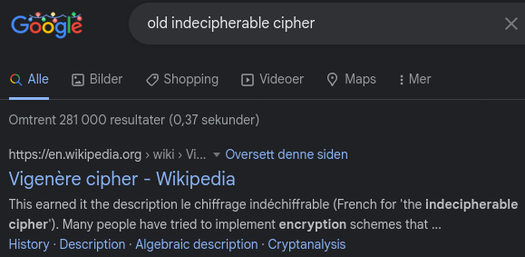
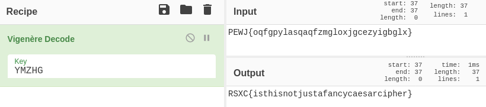
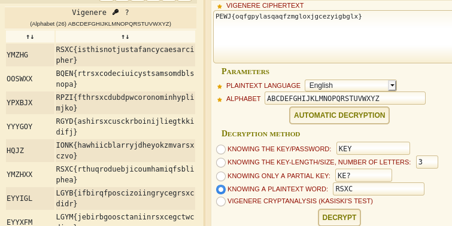

# Day 6 - The indecipherable cipher
We recently did some research on some old ciphers, and found one that supposedly was indecipherable, but maybe you can prove them wrong?


## Write-Up
As the challenge we are given a text that almost looks like the Flag we are after.

```
PEWJ{oqfgpylasqaqfzmgloxjgcezyigbglx}
```
We are given some hints that this is an old crypto which was thought to be indecipherable. Let's google `old indecipherable cipher` and see what we get...



So the first result is `Vigenère cipher`, which looks promising. We could try to decrypt this message with `CyberChef`, trying one character at a time... This works, but takes a little bit of time!



We can also use some online tools for decrypting this. I found a nice online tool on day4, https://www.dcode.fr/xor-cipher. This site also has other tools and of course one for Vigenère :) As we guess that some plain text include "RSXC" we get this result.



## The Flag
Flag: RSXC{isthisnotjustafancycaesarcipher}