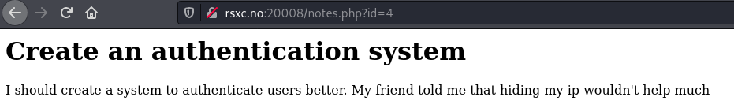
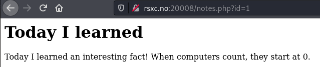
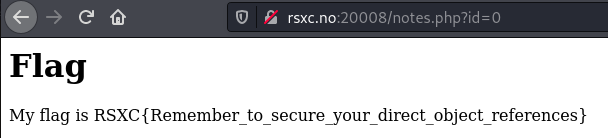

# Day 8 - The reference

I just created a new note saving application, there is still some improvements that can be made but I still decided to show it to you!

## WriteUp

Browse to the given link and view the page

Looking at the last note, Note4, we see that the URL changes and uses some GET parameters. This parameter, id, seems to be related to which note is displayed.

Testing with setting id=1 gives us this page

We probably knew this about counting. If we then set id=0 we get what we are looking for... the Flag :)

## The Flag
RSXC{Remember_to_secure_your_direct_object_references}