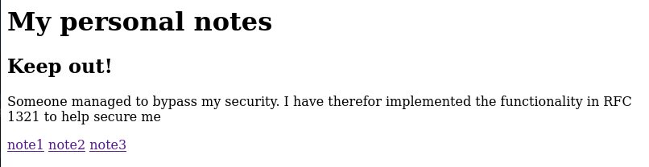
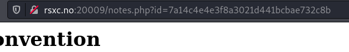
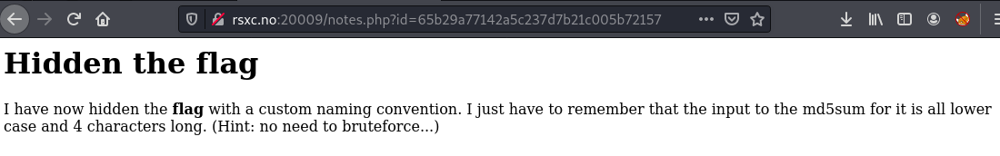
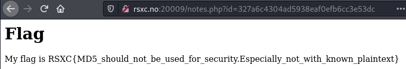

# Day 9 - The reference 2

I see that someone managed to read my personal notes yesterday, so I have improved the security! Good luck!

## WriteUp

We begin by opening the given link and view the page.



After reading all the notes we have gotten some clues/hints.
- Namingconvetion - note + id number
- RFC1321 - RFC describing MD5
- id of note3 - 7a14c4e4e3f8a3021d441bcbae732c8b



Testing what we know, we could try to make a MD5 hash of the text "note3".

```shell
$ echo -n "note3" | md5sum
7a14c4e4e3f8a3021d441bcbae732c8b  -
```

The initial page had links for note1 ... note3. We should now create a md5sum for "note0" and try it.

```shell
$ echo -n "note0" | md5sum
65b29a77142a5c237d7b21c005b72157  -
```

We have found a new note with a good hint.



The text, **flag**, is in **bold**, and the hint says the input to md5sum is 4 characters and no brute force is needed...

```shell
$ echo -n "flag" | md5sum 
327a6c4304ad5938eaf0efb6cc3e53dc  -
```

Checking this id gives us what we are looking for.




## The Flag
RSXC{MD5_should_not_be_used_for_security.Especially_not_with_known_plaintext}