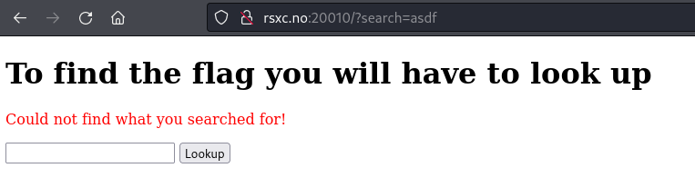
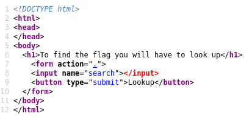
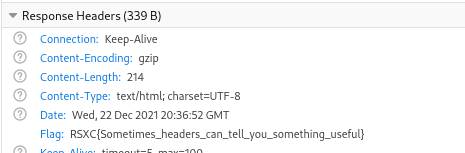

# Day 10 - Lookup
Sometimes you need to look up to get the answer you need.

## Write-Up
Todays challenge gives us a website where it looks like we can lookup something. But from some reason we are getting "Could not find what you searched for!" for whatever we are searching for... 

After trying what I could think of... even the most remote ideas.... without luck! 
I took a look at the *source*... WHICH should have been done way earlier!

After looking at the source for at bit, I realised there was a hint right in front of me... also that the hint had been there the whole *frickin* time... It was never **Lookup**, but **Look UP**. Viewing the source and realising this... This was the *BODY* of the code, and when Looking UP we look at the HEAD. So off to take a look at the HEADers... Opening *developer tools* and viewing the headers... BEHOLD!!

## The Flag
RSXC{Sometimes_headers_can_tell_you_something_useful}