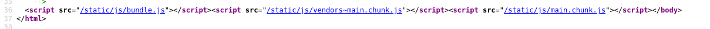

# Day 13 - New technology is hard

When starting with new languages and frameworks, it is easy to get confused, and do things you shouldn't.

## Write-Up
For todays challenge we are given a link to a new "ToDo App". This time I will look at the source from the start... mental reminder from earlier challenge. I try a few *command injection*, *bad characters*, etc... but nothing... SO diving into the source code...



There are three JavaScript files to look at... Taking a quick look at all of them and finding that the last one, main.chunk.js, looks to contain keywords that sound related to the Todo App; App(), TodoList(), Todo()....

Scrolling through the code, my eyes suddenly makes me stop...

```js
function Todos() {
  const b64 = "UlNYQ3tpdF9taWdodF9iZV90aGVyZV9ldmVuX2lmX3lvdV9kb24ndF9pbmNsdWRlX2l0IX0=";
  return /*#__PURE__*/Object(react_jsx_dev_runtime__WEBPACK_IMPORTED_MODULE_1__["jsxDEV"])("div", {
    children: /*#__PURE__*/Object(react_jsx_dev_runtime__WEBPACK_IMPORTED_MODULE_1__["jsxDEV"])("p", {
      children: ["Hide this somewhere, and not just rely on base64: ", b64]
    }, void 0, true, {
```

There we have a Base64 string and a text telling us that something is to be hidden... **Ay Caramba!!!!**
```sh
$ echo -n 'UlNYQ3tpdF9taWdodF9iZV90aGVyZV9ldmVuX2lmX3lvdV9kb24ndF9pbmNsdWRlX2l0IX0=' | base64 -d
RSXC{it_might_be_there_even_if_you_don't_include_it!}
```

## Flag
RSXC{it_might_be_there_even_if_you_don't_include_it!}