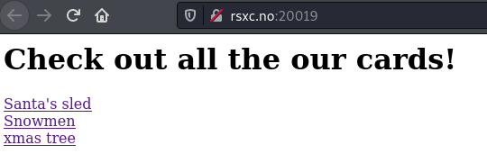
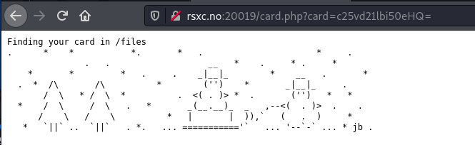
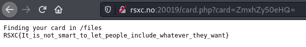

# Day 19 - The inclusive xmas cards

We felt that the our last xmas cards weren't that inclusive. So we made even more options, so everyone has one that fits them!

## Write-Up

We begin by opening the given link and view the page.



Viewing all the notes does not give us much...



But if we look at the URL we see there is a GET parameter *card* with a value of "c25vd21lbi50eHQ="

If we look at the source for the first page we see that the links all have these values that looks like strings encoded using *base64* 

Testing our assumptions
```shell
$ echo -n c2FudGEudHh0 | base64 -d
santa.txt
```

So this is decoded to what looks like a filename. Trying to decode the filename of the file we are looking for, *flag.txt*, gives us this value which we can use.

```
$ echo -n flag.txt | base64       
ZmxhZy50eHQ=
```



## The Flag
RSXC{It_is_not_smart_to_let_people_include_whatever_they_want}
