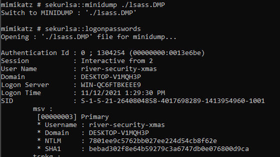

# Day 21 - Nice memories

Note: The flag is the clear text password for river-security-xmas user.
On a IR mission we found that the threatactor dumped lsass file.
Can you rock our world and find the flag for us?


## Write-Up
It is just a couple of days until Christmas and we have a new challenge. Let's help find the flag, or as the hint says... "the clear text password for river-security-xmas user".

Unzippping the challenge file, we see that we are given a "lsass.DMP" file as said in the text... and nothing more. Let's use `mimikatz` to extract information from this file and see what we get.



It extract what we need to continue. We have the given username and a NTLM hash. As we are asked to find the clear text password, we need to crack this hash. Let's us `HashCat` today for the fun of it.

For `hashcat` we need some input

- Attack Mode: Straight wordlist, attack mode 0 (-a 0)
- Hash-Mode: NTLM, mode 1000 (-m 1000)
- File with the hash(es): NTLM hash from `mimikatz` output
- Wordlist: rouckyou wordlist, Hint given in todays challenge text

As I'm running this in a VM the hashrate will not be the greatest, but we are only cracking one hash/password.

```PS
PS C:\hashcat> .\hashcat.exe -a 0 -m 1000 .\rsxc-day21-hashes.txt .\rockyou.txt

hashcat (v6.2.5) starting

OpenCL API (OpenCL 2.1 WINDOWS) - Platform #1 [Intel(R) Corporation]
====================================================================
* Device #1: AMD Ryzen 9 5900X 12-Core Processor, 4063/8191 MB (1023 MB allocatable), 4MCU

Minimum password length supported by kernel: 0
Maximum password length supported by kernel: 256

Hashes: 1 digests; 1 unique digests, 1 unique salts
Bitmaps: 16 bits, 65536 entries, 0x0000ffff mask, 262144 bytes, 5/13 rotates
Rules: 1

Optimizers applied:
* Zero-Byte
* Early-Skip
* Not-Salted
* Not-Iterated
* Single-Hash
* Single-Salt
* Raw-Hash

Host memory required for this attack: 1 MB

Dictionary cache hit:
* Filename..: .\rockyou.txt
* Passwords.: 14344384
* Bytes.....: 139921497
* Keyspace..: 14344384

7801ee9c5762bb027ee224d54cb8f62e:alliwantforchristmasisyou

Session..........: hashcat
Status...........: Cracked
Hash.Mode........: 1000 (NTLM)
Hash.Target......: 7801ee9c5762bb027ee224d54cb8f62e
Time.Started.....: Tue Dec 21 16:13:14 2021 (1 sec)
Time.Estimated...: Tue Dec 21 16:13:15 2021 (0 secs)
Kernel.Feature...: Pure Kernel
Guess.Base.......: File (.\rockyou.txt)
Guess.Queue......: 1/1 (100.00%)
[...]
```
We got our password and flag!

`John the Ripper` would have solved this easily as well

```
$ john --format=NT ./rsxc-day21-hashes.txt --wordlist=/usr/share/wordlists/rockyou.txt
Using default input encoding: UTF-8
Loaded 1 password hash (NT [MD4 256/256 AVX2 8x3])
Warning: no OpenMP support for this hash type, consider --fork=8
Press 'q' or Ctrl-C to abort, almost any other key for status
alliwantforchristmasisyou (?)     
1g 0:00:00:00 DONE (2021-12-21 16:33) 3.030g/s 30948Kp/s 30948Kc/s 30948KC/s alliwantisy0oh..allisonpunk
Use the "--show --format=NT" options to display all of the cracked passwords reliably
Session completed.
```

## The Flag
alliwantforchristmasisyou