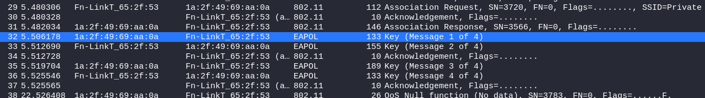

# Day 22 - Wireless communication

We tried to find a new way of sending the flag, and this time it is even encrypted! Since we are nice we will even give you a hint. The password starts with S. Can you Rock our world?

## Write-Up
So what do we have today? A `cap` file and the heading "Wireless communication". First off, download the file and verify what kind of file this is. This tells us that indeed we are facing some wireless traffic and have a packet capture ready for investigation. Let's start up `Wireshark` and see what we can find.

```
$ file 22-challenge.cap 
22-challenge.cap: pcap capture file, microsecond ts (little-endian) - version 2.4 (802.11, capture length 262144)
```



If we also look at the Protocol Statistics, we see that we have Wireless traffic data and Authentication packets. From the first picture, we see that we have the whole WPA/WPA2 4-way handshake; EAPOL packets 1..4.


Our first task looks to be cracking this WPA key. As we have been given a hint for what the password should be, we'll first create a small local wordlist; All words starting with *S* from the known wordlist file **rockyou**.

```shell
$ grep -a ^S /usr/share/wordlists/rockyou.txt >> ./rock-S-list.txt
```

We can now use `aircrack-ng` to crack the key. And after a few seconds we have cracked the key.

```shell
$ aircrack-ng ./22-challenge.cap -w ./rock-S-list.txt
```


Unfortunately this is not the Flag for todays challenge. We need to dig a bit deeper. So we turn back to Wireshark. As we now have the *key* for decrypting the traffic we should be able to get more out of the capture file.

We first need to enable the *Wireless Toolbar*, which will give us a *802.11 Preferences* button under the *Filter Toolbar*. Pressing this button will open a new windows where we will find *Decryption keys*. We now need to edit these keys and add our new found key :)

 

 

Applying the changes and geting back to the main Wireshark window, it almost looks like there has been no change at all. BUT if we scroll down, we will now find ARP and TCP traffic packets!


ARP does not sound too interresting, but the TCP packets we should have a close look at. Right-click and follow TCP stream... and we have our flag.


## The Flag
RSXC{WIFI_is_fun}

## Bonus - Hashcat WPA Key Cracking
As `aircrack-ng` has, to my knowledge, limited cracking options we may use Hashcat.

To be able to crack the WPA key with hashcat we need to convert the needed data into a hash understood by Hashcat... and there is a tool-set for that `hcxtools` found for many *nix distros.
Within we find `hcxpcapngtool` which we use to output the needed to a new file. We can then crack the key with Hashcat; attack-mode 0, hash-mode 22000.

```shell
$ sudo apt install hcxtools

$ hcxpcapngtool -o rsxc22-cap.hashcat 22-challenge.cap

$ hashcat -a 0 -m 22000 ./rsxc22-cap.hashcat ./rock-S-list.txt

[Output]
Dictionary cache built:
* Filename..: .\rock-S-list.txt
* Passwords.: 98554
* Bytes.....: 959030
* Keyspace..: 98554
* Runtime...: 0 secs

9572670922380a9b155f57a47d896867:1a2f4969aa0a:a02c36652f53:Private:Santaclaws99

Session..........: hashcat
Status...........: Cracked
Hash.Mode........: 22000 (WPA-PBKDF2-PMKID+EAPOL)
Hash.Target......: .\rsxc22-cap.hashcat
Time.Started.....: Wed Dec 22 20:51:36 2021 (1 sec)
Time.Estimated...: Wed Dec 22 20:51:37 2021 (0 secs)
[END]
```
