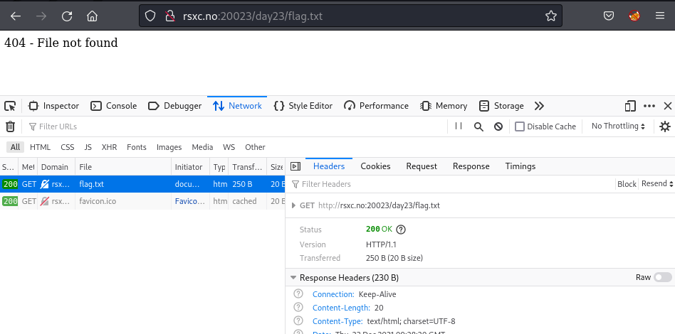

# Day 23 - Locating the location

We seem to have lost a file, can you please help us find it?

## Write-Up
When browsing to the site we are met with the following message (and hints)


We could try a simple quess to see the results.



**dirb** is a tool for scanning for directories based on wordlist(s), and has some nice wordlists included. One of our hints indicate what we should use the *small.txt* wordlist as the input to our scanner for finding the correct directory. We need to FUZZ/Guess the directory of the request. But as it seems that every GET request gives a status *200 OK*, ref headers in image above, and we cannot filter on this. *Content-Length* should increase if we find the right path, as it should display more text and our flag.

For this we will use another tool, *FFUF*, https://github.com/ffuf/ffuf. This tool have more options and is also able to FUZZ part(s) of the URL. As options we will use

- *-u*, for the URL: `http://rsxc.no:20023/FUZZ/flag.txt`
- *-w*, for wordlist: `/usr/share/dirb/wordlists/small.txt`
- *-fs 20*, for filter response size as we want to exlude repsone with content-length = 20

```shell
$ ffuf -u http://rsxc.no:20023/FUZZ/flag.txt -w /usr/share/dirb/wordlists/small.txt -fs 20

        /'___\  /'___\           /'___\       
       /\ \__/ /\ \__/  __  __  /\ \__/       
       \ \ ,__\\ \ ,__\/\ \/\ \ \ \ ,__\      
        \ \ \_/ \ \ \_/\ \ \_\ \ \ \ \_/      
         \ \_\   \ \_\  \ \____/  \ \_\       
          \/_/    \/_/   \/___/    \/_/       

       v1.3.1 Kali Exclusive <3
________________________________________________

 :: Method           : GET
 :: URL              : http://rsxc.no:20023/FUZZ/flag.txt
 :: Wordlist         : FUZZ: /usr/share/dirb/wordlists/small.txt
 :: Follow redirects : false
 :: Calibration      : false
 :: Timeout          : 10
 :: Threads          : 40
 :: Matcher          : Response status: 200,204,301,302,307,401,403,405
 :: Filter           : Response size: 20
________________________________________________

logfile                 [Status: 200, Size: 120, Words: 13, Lines: 3]
:: Progress: [959/959] :: Job [1/1] :: 974 req/sec :: Duration: [0:00:04] :: Errors: 0 ::
```

We see that we have found one directory and if we `cURL` we should find our flag

```shell
$ curl http://rsxc.no:20023/logfile/flag.txt   
  <h1> Thank you for finding my flag!</h1>
  <p>RSXC{Content_discovery_is_a_useful_to_know.Good_job_finding_the_flag}
```

## The Flag
RSXC{Content_discovery_is_a_useful_to_know.Good_job_finding_the_flag}